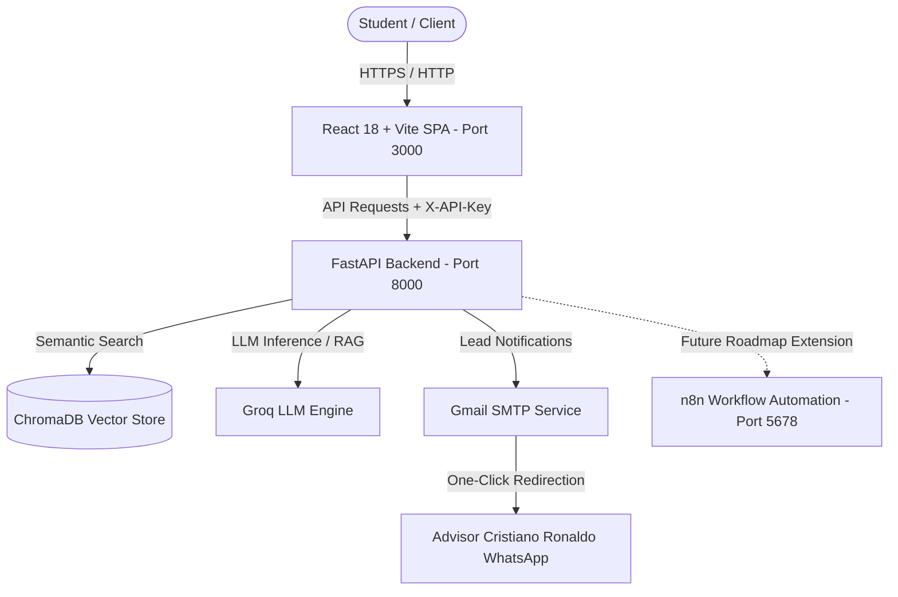
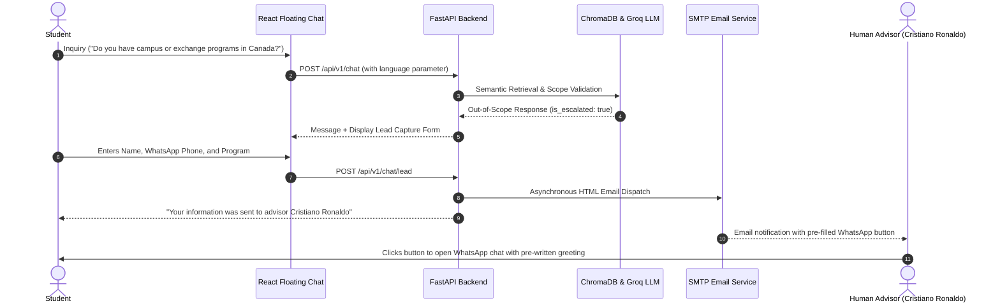

# 📚 Technical Documentation - Academia Lumina AI Customer Support System

Welcome to the comprehensive technical documentation for **Academia Lumina AI**, a full-stack customer support and lead generation platform powered by **Retrieval-Augmented Generation (RAG)**, ultra-fast LLM inference (**Groq**), 4 robust layers of **Cybersecurity**, **Multilingual (EN/ES) support**, accessible **Dark Mode**, and **Automated WhatsApp Redirection**.

---

## 🏛️ 1. Architecture Overview

The system is built as a containerized microservices architecture using **Docker Compose**:



### Core Components:
1. **Frontend (React 18 + Vite + Nginx)**:
   - Modern Single Page Application (SPA) with 2 primary views: *Home & Programs* and *Modalities & Certification*.
   - Global reactive state for **Language Toggle** (English by default with Spanish toggle) and **Theme Switcher** (Egyptian Gold Light & Deep Obsidian Dark).
   - Responsive floating chat widget with fullscreen native sheet on mobile, typing indicators, and in-chat lead capture forms.
2. **Backend (FastAPI + Python 3.12)**:
   - RAG pipeline integrating ChromaDB with in-memory TTL caching for sub-second query resolution.
   - 4 Active cybersecurity layers.
   - Asynchronous SMTP lead email dispatch with formatted WhatsApp pre-filled contact links.
3. **Optional Automation Engine (n8n)**:
   - Decoupled orchestration blueprint for future multi-channel expansion (Meta WhatsApp Cloud API, Telegram, CRM syncing).

---

## 🛡️ 2. The 4 Cybersecurity Defense Layers

| Security Layer | Technical Implementation | Code Location |
| :--- | :--- | :--- |
| **1. Real Client IP Rate Limiting** | Dynamic rate limiting (10 req/min) using SlowAPI, extracting real client IP from `X-Forwarded-For` to prevent collective DoS behind reverse proxies. | `backend/app/core/security.py` |
| **2. API Key Authentication** | Mandatory `X-API-Key` header verification on all private endpoints (`/chat`, `/chat/lead`, `/metrics`). | `backend/app/core/security.py` |
| **3. Anti-Prompt Injection Guardrails** | Unicode normalization (NFKD) and regex-based pattern matching blocking Jailbreaks, system prompt extractions, and instruction overrides. | `backend/app/core/guardrails.py` |
| **4. PII Protection & XSS Sanitization** | Automatic masking of Colombian national IDs and mobile numbers in responses, plus `html.escape()` sanitization in MIME email templates. | `backend/app/core/config.py` & `email_service.py` |

---

## 🤖 3. Intelligent Conversation & Lead Capture Flow



### Knowledge Base & Escalation Rules:
- **In-Scope Academy Queries** (*Programs, Tuition, Schedules, Modalities, CEFR Certification*): The bot answers directly and completely using official knowledge base records.
- **Off-Topic / Unrelated Inquiries** (*Math arithmetic, cooking recipes, programming, trivia*): Politely declined without escalating to human advisors.
- **Unlisted Institutional Services / Out-of-Scope** (*Exchange trips to Canada, sports scholarships, parking/amenities*): Automatically displays the lead form to connect with admissions advisor **Cristiano Ronaldo**.

---

## 🌐 4. Multilingual (i18n) & Dark Mode Engine

### Real-Time Language Switching (EN / ES):
- Uses React Context (`LanguageContext`) with full translation dictionaries.
- Default interface language is **English**, switchable to **Spanish** via the globe button in the top navigation bar.
- The RAG backend dynamically receives the active language parameter and enforces response generation strictly in the requested language.

### Accessible Dark Mode:
- Controlled by `ThemeContext` with local storage persistence.
- Curated high-contrast palette:
  - **Background**: `#0f0e0d` (Dark Obsidian) / `#fdfbf7` (Light Papyrus)
  - **Cards**: `#191715` / `#ffffff`
  - **Accents**: `#f3cf55` / `#d4af37` (Egyptian Gold)
- Complies with WCAG contrast standards and includes `@media (prefers-reduced-motion: reduce)` accessibility support.

---

## 🔮 5. Future Roadmap: Omnichannel & n8n Integration

While the web platform operates autonomously via FastAPI, the included **n8n service** provides a plug-and-play foundation for future development:

1. **Meta WhatsApp Cloud Business API**:
   - Direct webhook reception in n8n (`/webhook/chat`) for automated bidirectional WhatsApp messaging on official enterprise phone lines.
2. **CRM & Lead Syncing**:
   - Automatic insertion of captured leads into Google Sheets, Notion, HubSpot, or Salesforce.
3. **Multi-Platform Support**:
   - Connecting Telegram, Facebook Messenger, and Instagram Direct to the same centralized RAG backend.

---

## 🚀 6. Deployment & Execution Guide

### Local Development with Docker:
```bash
# 1. Clone repository
git clone <REPOSITORY_URL>
cd PruebaDesempe-oAI

# 2. Build and launch all services
docker compose up -d --build

# 3. Check service health
docker compose ps
```

### Production Deployment (e.g., Render):
1. **Backend Web Service**: Deploy `backend/` using Docker runtime with required environment variables (`GROQ_API_KEY`, `BACKEND_API_KEY`, `SMTP_USER`, `SMTP_PASSWORD`, `ALLOWED_ORIGINS`).
2. **Frontend Static Site**: Deploy `frontend/` with build command `npm run build` and publish directory `dist`, passing `VITE_BACKEND_URL` and `VITE_BACKEND_API_KEY`.

---

## 🧪 7. Automated Testing

Run the full test suite inside the backend container:

```bash
docker exec lumina_backend pytest -v
```

*Current Suite Status:* **16 passed, 0 failed (100% test pass rate)**.
