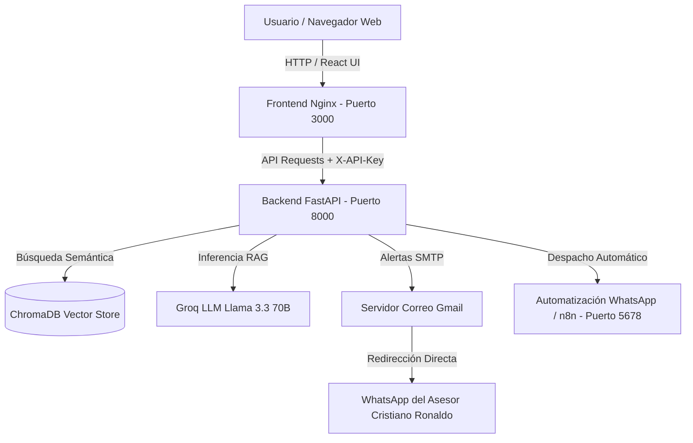
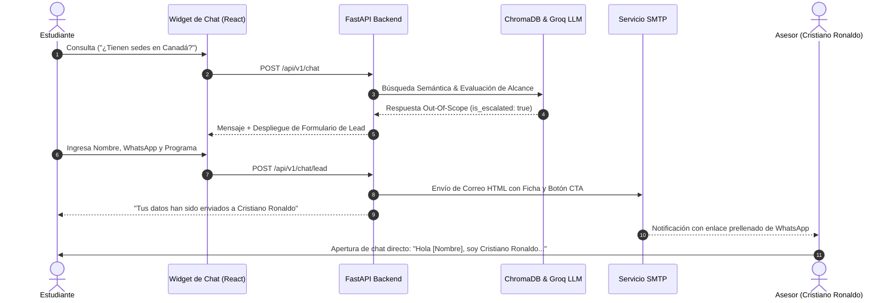

# 📚 Documentación Integral del Sistema - Academia Lumina AI

Bienvenido a la documentación técnica oficial de **Academia Lumina AI**, un sistema integral de atención al cliente potenciado por **Generación Aumentada por Recuperación (RAG)**, modelos LLM avanzados de inferencia ultrarrápida (**Groq**), 4 capas robustas de **Ciberseguridad**, automatización de **WhatsApp**, soporte multilingüe (**i18n EN/ES**), y diseño responsivo accesible con **Modo Oscuro**.

---

## 🏛️ 1. Arquitectura General del Sistema

El proyecto está diseñado bajo una arquitectura modular desacoplada basada en microservicios contenerizados mediante **Docker Compose**:



### Componentes Principales:
1. **Frontend (React + Vite + Nginx)**:
   - SPA de 2 vistas optimizadas: *Inicio & Programas* y *Modalidades & Certificación*.
   - Selector de idioma en tiempo real (**Inglés por defecto con toggle a Español**).
   - Selector de tema (**Modo Claro Papiro/Oro Egipcio y Modo Oscuro Obsidiana**).
   - Widget flotante interactivo con indicador de escritura (*typing indicator*), animaciones de pulso y formulario de captura de leads.
2. **Backend (FastAPI + Python 3.12)**:
   - Pipeline RAG con ChromaDB y caché TTL en memoria para respuestas en milisegundos.
   - 4 Capas de seguridad informática activas.
   - Despacho de correos SMTP asíncronos y automatización de presentación de WhatsApp.
3. **Automatización (n8n)**:
   - Flujo de orquestación y webhook para escalamiento y recepción de solicitudes.

---

## 🛡️ 2. Las 4 Capas de Ciberseguridad Implementadas

El sistema cumple rigurosamente con los 4 pilares de seguridad requeridos:

| Capa de Seguridad | Implementación Técnica | Ubicación en el Código |
| :--- | :--- | :--- |
| **1. Rate Limiting por IP Real** | Limitación de tasa configurable (10 req/min) mediante SlowAPI extrayendo la IP real desde `X-Forwarded-For` para evitar evasión tras proxies inversos. | `backend/app/core/security.py` |
| **2. Autenticación por X-API-Key** | Validación obligatoria de la cabecera `X-API-Key` en todos los endpoints privados (`/chat`, `/chat/lead`, `/metrics`). | `backend/app/core/security.py` |
| **3. Anti-Prompt Injection & Guardrails** | Normalización Unicode (NFKD) y filtrado estricto por expresiones regulares de patrones de Jailbreak, evasión y manipulación de instrucciones. | `backend/app/core/guardrails.py` |
| **4. Gestión Segura de Secretos & Sanitización PII** | Centralización de credenciales en `.env` vía Pydantic BaseSettings, enmascaramiento de datos sensibles (cédulas y teléfonos) y desinfección HTML XSS en plantillas MIME. | `backend/app/core/config.py` y `email_service.py` |

---

## 🤖 3. Flujo Inteligente de Conversación y Captura de Leads



### Reglas de Inteligencia y Filtros:
- **Consultas sobre la Academia** (*Programas, Precios, Horarios, Modalidades, Certificación*): El bot responde inmediatamente con los datos oficiales de la base vectorial sin solicitar formulario.
- **Preguntas Ajenas / Matemáticas (Off-Topic)** (*ej. "cuánto es 100 + 100", chistes, código*): El bot responde amablemente indicando que solo está programado para resolver dudas de la academia, sin escalar a asesor.
- **Consultas Fuera de Alcance Institucional** (*ej. intercambios a Canadá, visas, tours*): El bot despliega el formulario de lead para conectar con Cristiano Ronaldo.

---

## 🌐 4. Soporte Multilingüe (i18n) y Modo Oscuro

### 🇺🇸 Toggle de Idioma (Inglés / Español):
- El sistema inicia en **Inglés** por defecto para cumplir con el estándar internacional y permite alternar a **Español** con un solo clic en el botón de globo terráqueo del Navbar.
- Toda la interfaz (Hero, Beneficios, Catálogo de Programas, Modalidades, Ruta MCER, Certificación, Testimonios, Footer y Chat) se adapta de forma instantánea mediante el contexto global `LanguageContext`.

### 🌙 Modo Oscuro / Claro Accesible:
- Alternador de tema sol/luna integrado en la barra de navegación.
- Paleta **Dark Obsidian & Egyptian Gold** (`--papyrus-bg: #0f0e0d`, `--papyrus-card: #191715`, `--text-dark: #f5f0e6`, `--egyptian-gold: #f3cf55`).
- Alto contraste accesible que previene fatiga visual y mantiene la identidad de marca egipcia/dorada.

---

## 🚀 5. Guía de Despliegue y Ejecución

### Prerrequisitos:
- Docker y Docker Compose instalados.
- Archivo `.env` configurado en la carpeta `backend/`.

### Comandos de Inicialización:
```bash
# 1. Clonar el repositorio
git clone <URL_REPOSITORIO>
cd PruebaDesempe-oAI

# 2. Construir e iniciar todos los servicios
docker compose build
docker compose up -d

# 3. Verificar estado de los contenedores
docker compose ps
```

### Endpoints y Servicios Activos:
- 🌐 **Frontend Web**: [http://localhost:3000](http://localhost:3000)
- ⚙️ **Documentación Swagger API**: [http://localhost:8000/docs](http://localhost:8000/docs)
- 🩺 **Health Check**: [http://localhost:8000/api/v1/health](http://localhost:8000/api/v1/health)
- 📊 **Métricas Operativas**: [http://localhost:8000/api/v1/metrics](http://localhost:8000/api/v1/metrics)
- 🔄 **Orquestador n8n**: [http://localhost:5678](http://localhost:5678)

---

## 🧪 6. Pruebas Automatizadas

El proyecto cuenta con una suite completa de pruebas unitarias y de integración en `pytest`:

```bash
docker exec lumina_backend pytest -v
```

### Cobertura de Pruebas:
- ✅ `test_security.py`: Autenticación por cabecera `X-API-Key`, bloqueo de Prompt Injection y validación de permisos.
- ✅ `test_rag_service.py`: Generación de respuestas semánticas, caché TTL y control estricto de escalamiento.
- ✅ `test_email_service.py`: Construcción de plantillas HTML, sanitización de datos y despacho asíncrono.
- ✅ `test_health.py` & `test_extras.py`: Verificación de endpoints de salud, métricas y ciclo de vida de la aplicación.
