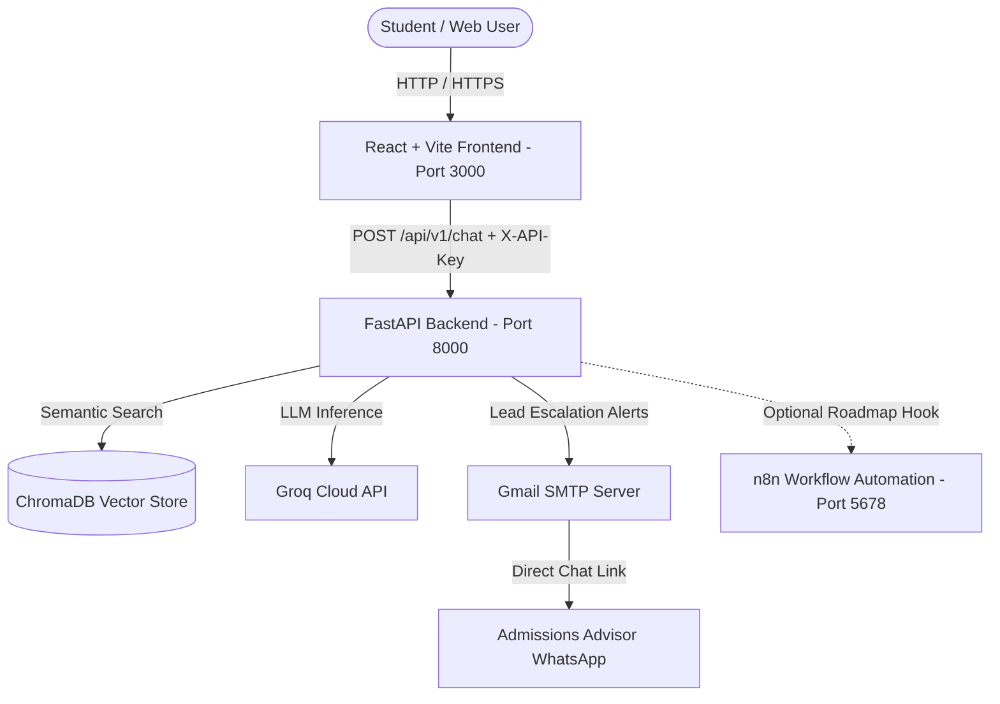

# Academia Lumina AI - Intelligent Multilingual Customer Support System

[](https://www.docker.com/)
[](https://www.python.org/)
[](https://fastapi.tiangolo.com/)
[](https://groq.com/)
[](https://www.trychroma.com/)
[](https://reactjs.org/)
[](https://vitejs.dev/)

An enterprise-grade, full-stack AI Customer Support System built for **Academia Lumina** (a language academy in Colombia). Powered by **Retrieval-Augmented Generation (RAG)** over official academic documents, **Groq ultra-fast LLM inference**, **4 Cybersecurity defense layers**, **Dynamic Multilingual (EN/ES) support**, and **Interactive Lead Capture with WhatsApp advisor redirection**.

---

## 🌟 Key Features

- **🧠 RAG Knowledge Engine**: Semantic search using persistent ChromaDB embeddings and Groq LLM inference (`openai/gpt-oss-120b` / Llama 3.3 70B) with memory TTL caching.
- **🛡️ 4 Cybersecurity Layers**:
  1. *Real Client IP Rate Limiting* with proxy sanitization (SlowAPI).
  2. *API Key Authentication* via `X-API-Key` headers.
  3. *Anti-Prompt Injection Guardrails* with NFKD Unicode normalization and leetspeak neutralization.
  4. *PII Redaction & HTML XSS Sanitization* in emails and responses.
- **🌐 Real-Time Multilingual Support (i18n)**: Instant English/Spanish UI toggle and strict language-matching LLM responses.
- **🌙 Dark / Light Accessible Theme**: Egyptian Sand & Gold (Light) and Deep Obsidian Gold (Dark) palettes with smooth 60fps transitions.
- **📱 Mobile-First Responsive Design**: Fullscreen native sheet chat on mobile devices (`<600px`), interactive CEFR A1→C1 progression flowchart, and expandable course cards.
- **📥 Lead Capture & Automated Dispatch**: In-chat contact form for unlisted queries, SMTP notification emails to administrators, and direct pre-filled WhatsApp conversation links for admissions advisors.
- **🔮 Future Roadmap / Optional Extension (n8n Integration)**: An included `n8n` service blueprint for future multi-channel automation (Meta WhatsApp Cloud API, Telegram, CRMs like HubSpot/Salesforce).

---

## 🏗️ System Architecture



> **📌 Note on n8n:** The web application and backend operate **100% autonomously**. The included `n8n` container and `workflow.json` serve as an optional, decoupled future expansion milestone to connect external messaging channels (WhatsApp Cloud API, Telegram) without modifying backend Python code.

---

## 🔑 Environment Configuration

### 1. Backend Configuration (`backend/.env`)

Copy the example file and configure your environment variables:

```bash
cd backend
cp .env.example .env
```

| Variable | Description | Default / Example |
|---|---|---|
| `GROQ_API_KEY` | Groq API Key for LLM Inference ([Get key](https://console.groq.com/keys)) | `gsk_your_groq_key_here` |
| `BACKEND_API_KEY` | Secret key for authenticating incoming API requests | `your_secure_api_key_here` |
| `ENVIRONMENT` | Application environment (`development` / `production`) | `development` |
| `ALLOWED_ORIGINS` | Comma-separated allowed CORS origins | `http://localhost:3000,http://127.0.0.1:3000` |
| `RATE_LIMIT_PER_MINUTE`| Maximum allowed requests per minute per IP | `10/minute` |
| `ADVISOR_NAME` | Name of the admissions advisor for WhatsApp escalation | `Admissions Advisor` |
| `WHATSAPP_NUMBER` | Official WhatsApp contact phone number | `+57 300 000 0000` |
| `WHATSAPP_URL` | Direct WhatsApp URL endpoint | `https://wa.me/573000000000` |
| `ESCALATION_EMAIL` | Destination email for escalated student leads | `admissions@academialumina.edu.co` |
| `SMTP_HOST` / `PORT` | SMTP Server configuration for lead emails | `smtp.gmail.com` / `587` |
| `SMTP_USER` / `PASSWORD`| SMTP authentication credentials | `your_email@gmail.com` / `app_password` |

### 2. Frontend Configuration (`frontend/.env`)

```bash
cd frontend
cp .env.example .env
```

| Variable | Description | Default |
|---|---|---|
| `VITE_BACKEND_URL` | Base URL of the FastAPI Backend | `http://localhost:8000` |
| `VITE_BACKEND_API_KEY` | Secret API Key (must match `BACKEND_API_KEY`) | `your_secure_api_key_here` |

---

## 🚀 Quick Start with Docker (Recommended)

Start the entire containerized application with Docker Compose:

```bash
docker compose up -d --build
```

### Service Endpoints:
- 🌐 **Web Frontend**: [http://localhost:3000](http://localhost:3000)
- ⚡ **Backend API & Swagger Docs**: [http://localhost:8000/docs](http://localhost:8000/docs)
- 🩺 **Health Check**: [http://localhost:8000/api/v1/health](http://localhost:8000/api/v1/health)
- 📊 **Metrics Endpoint**: [http://localhost:8000/api/v1/metrics](http://localhost:8000/api/v1/metrics)
- 🔮 **n8n Automation Console (Optional Extension)**: [http://localhost:5678](http://localhost:5678)

---

## 🧪 Automated Testing

Execute the complete automated test suite inside the backend Docker container:

```bash
docker exec lumina_backend pytest -v
```

---

## 📂 Project Structure

```text
.
├── backend/
│   ├── app/
│   │   ├── api/v1/endpoints/  # Chat, Lead, Health & Metrics endpoints
│   │   ├── core/              # Security, Guardrails, Rate Limiting & Config
│   │   ├── data/              # Markdown Knowledge Base documents
│   │   ├── db/                # ChromaDB VectorStore & TTL Cache
│   │   ├── schemas/           # Pydantic Request/Response models
│   │   ├── services/          # RAG, Ingestion, Email & Metrics services
│   │   └── main.py            # FastAPI Application Entrypoint
│   ├── tests/                 # Automated Pytest test suites
│   ├── Dockerfile
│   └── requirements.txt
├── frontend/
│   ├── src/
│   │   ├── components/        # Navbar, Hero, Programs, Flowchart, Chat, etc.
│   │   ├── context/           # LanguageContext (i18n) & ThemeContext (Dark Mode)
│   │   ├── services/          # API client helper
│   │   ├── App.jsx            # SPA Application Root
│   │   └── App.css            # Responsive Design System
│   ├── Dockerfile
│   └── package.json
├── n8n/
│   └── workflow.json          # Blueprint for future omnichannel expansion
├── docker-compose.yml
├── DOCUMENTATION.md           # Comprehensive Technical Documentation (Spanish)
└── README.md                  # Official Project Deliverable (English)
```

---

## 📄 License
Developed for Academia Lumina. All rights reserved © 2026.
