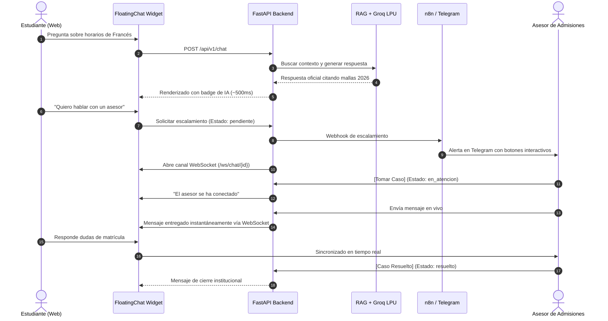

# 🏛️ Academia Lumina AI - Sistema Inteligente de Soporte Multilingüe y Atención en Vivo

[](https://www.docker.com/)
[](https://www.python.org/)
[](https://fastapi.tiangolo.com/)
[](https://groq.com/)
[](https://www.trychroma.com/)
[](https://reactjs.org/)
[](https://tailwindcss.com/)
[](https://fastapi.tiangolo.com/advanced/websockets/)
[](https://n8n.io/)

**Academia Lumina AI** es una solución tecnológica integral de atención al cliente, orientación académica y soporte comercial para **Academia Lumina** (institución de enseñanza de idiomas en Colombia). Combina **Inteligencia Artificial Generativa con RAG (Retrieval-Augmented Generation)** fundamentada exclusivamente en documentos oficiales, **canales bidireccionales en tiempo real vía WebSockets para transferencia en vivo a asesores humanos (Live Human Handoff)**, **automatizaciones omnicanal con Telegram y n8n**, y un **panel administrativo integral con ingesta documental multiformato y métricas de SLA**.

---

## 🏗️ Arquitectura General del Sistema

El sistema opera bajo una arquitectura desacoplada orientada a servicios, donde cada capa tiene responsabilidades claramente delimitadas:

```mermaid
graph TD
    subgraph Clientes ["Canales de Usuario"]
        Estudiante["Estudiante / Visitante Web<br>(React SPA)"]
        AsesorWeb["Asesor de Admisiones<br>(Admin Panel Web)"]
        AsesorTG["Asesor en Movilidad<br>(Telegram App)"]
    end

    subgraph FrontendApp ["Frontend Layer (Puerto 3000)"]
        Landing["Landing Page Institucional"]
        WidgetChat["FloatingChat Widget<br>(HTTP + WebSocket)"]
        AdminConsola["Consola Administrativa<br>(Inbox + Métricas + Base RAG)"]
    end

    subgraph BackendAPI ["Backend API Layer (FastAPI - Puerto 8000)"]
        Seguridad["4 Capas de Seguridad<br>(RateLimit, JWT/ApiKey, Guardrails, PII)"]
        RAGService["Motor RAG + Groq LPU<br>(gpt-oss-120b / 20b)"]
        Caché["ResponseCache<br>(TTL en Memoria)"]
        WSManager["ConnectionManager<br>(Hub WebSockets /ws/chat y /ws/agent)"]
        Ingesta["IngestionService<br>(PDF, DOCX, MD, TXT)"]
        Repo["ConversationRepository<br>(Transacciones Atómicas)"]
        Cleanup["CleanupService<br>(Auto-limpieza 30 min)"]
    end

    subgraph Almacenamiento ["Bases de Datos y Persistencia"]
        RelacionalDB[("SQLite local / PostgreSQL Cloud<br>SQLAlchemy 2.0")]
        VectorStore[("ChromaDB Vector Store<br>Colección lumina_knowledge_base")]
    end

    subgraph Automatizacion ["Orquestación y Servicios Externos"]
        GroqCloud["Groq Cloud API"]
        GeminiCloud["Google Gemini API (Embeddings)"]
        n8nApp["n8n Automation Engine (Puerto 5678)"]
        TelegramBot["Telegram Bot API"]
    end

    Estudiante -->|HTTP / HTTPS| Landing
    Estudiante <-->|WebSocket /ws/chat/{id}| WSManager
    Estudiante -->|POST /chat| Seguridad

    AsesorWeb -->|HTTP / HTTPS| AdminConsola
    AsesorWeb <-->|WebSocket /ws/agent| WSManager

    Seguridad --> RAGService
    RAGService <--> Caché
    RAGService --> VectorStore
    RAGService --> GroqCloud

    Ingesta --> VectorStore
    Ingesta --> GeminiCloud

    WSManager <--> Repo
    Repo <--> RelacionalDB
    Cleanup --> RelacionalDB

    BackendAPI -->|Webhooks /chat y /leads| n8nApp
    n8nApp --> TelegramBot
    TelegramBot <--> AsesorTG
```

---

## ⚡ Flujo de Atención Conversacional (Ciclo de Vida)



---

## 🌟 Módulos y Documentación Específica

El proyecto se encuentra segmentado en módulos independientes, cada uno con su propia documentación detallada:

- ⚙️ **[Backend FastAPI (`backend/README.md`)](backend/README.md)**: Controladores API REST, WebSocket Hub, ciberseguridad perimetral (Rate Limiting, JWT, Guardrails), motor RAG, repositorio de datos y suite de 47 pruebas unitarias.
- 🌐 **[Frontend React (`frontend/README.md`)](frontend/README.md)**: Landing page institucional, widget conversacional flotante con fallback HTTP/WebSocket, panel del asesor (Bandeja de chats en vivo, Dashboard de métricas y gestor documental Base RAG).
- 🔄 **[Automatización n8n (`n8n/README.md`)](n8n/README.md)**: Los 4 flujos de automatización para escalamiento a Telegram con botones inline (`workflow.json`), captura de prospectos (`workflow_leads.json`), monitor de SLA cada 1 min (`workflow_sla.json`) y reporte matutino 8:00 AM (`workflow_reportes.json`).
- ☁️ **[Despliegue en Render (`RENDER_DEPLOYMENT.md`)](RENDER_DEPLOYMENT.md)**: Especificación para publicar en la nube con base de datos PostgreSQL administrada y variables de entorno de producción.

---

## 🚀 Guía Rápida de Instalación y Ejecución

### 1. Requisitos Previos
- **Docker Engine** (v24+) y **Docker Compose** (v2.20+)
- Clave de API de **Groq Cloud** ([groq.com](https://console.groq.com/keys))
- Clave de API de **Google Gemini** ([aistudio.google.com](https://aistudio.google.com/))

### 2. Configurar Variables de Entorno
Copia los archivos de plantilla y coloca tus claves reales:
```bash
cp backend/.env.example backend/.env
cp frontend/.env.example frontend/.env
```
*Edita `backend/.env` e ingresa tu `GROQ_API_KEY` y `GEMINI_API_KEY`.*

### 3. Iniciar la Plataforma Completa con Docker
```bash
docker compose up -d --build
```

### 4. URLs de Acceso a los Servicios
| Servicio | URL Local | Credenciales por Defecto |
| :--- | :--- | :--- |
| 🌐 **Portal Web y Chat Estudiante** | [http://localhost:3000](http://localhost:3000) | Acceso público libre |
| 🔒 **Panel del Asesor y Administrador** | [http://localhost:3000/admin](http://localhost:3000/admin) | Usuario: `admin` \| Contraseña: `LuminaAdmin2026!` |
| ⚡ **Backend API y Swagger Docs** | [http://localhost:8000/docs](http://localhost:8000/docs) | Cabecera: `X-API-Key: lumina_secret_key_2026` |
| 🩺 **Sonda de Salud (Health Check)** | [http://localhost:8000/api/v1/health](http://localhost:8000/api/v1/health) | Acceso público |
| 📊 **Endpoint de Métricas Operativas**| [http://localhost:8000/api/v1/metrics](http://localhost:8000/api/v1/metrics) | Requiere Bearer JWT o API Key |
| ⚙️ **Consola de Automatización n8n** | [http://localhost:5678](http://localhost:5678) | Configurable en primer ingreso |

### 5. Verificación de Pruebas Automatizadas (Pytest)
Ejecuta la suite completa de 47 pruebas dentro del contenedor:
```bash
docker exec lumina_backend pytest -v
```
*Resultado esperado: **47 passed, 100% de cobertura operacional**.*

---

## 📖 Manual de Uso Conciso por Roles

### 🎓 1. Visitante / Estudiante Web
1. Ingresa a `http://localhost:3000`.
2. Haz clic en el botón flotante del chat (esquina inferior derecha).
3. Pregunta cualquier duda sobre cursos, aranceles 2026, becas o certificaciones (ej. *"¿Qué costo tiene el nivel B1 de inglés?"*).
4. Para hablar con un humano, escribe *"Quiero hablar con un asesor"*. La interfaz te mantendrá conectado en vivo con el equipo de admisiones.

### 💼 2. Asesor de Admisiones
1. Ingresa a `http://localhost:3000/admin` con tus credenciales.
2. En la pestaña **"Bandeja de Chats"**, selecciona una conversación pendiente.
3. Haz clic en **`[Tomar caso]`** para asignártela de forma exclusiva.
4. Escribe tus respuestas en el campo de texto inferior; los mensajes se transmiten al estudiante instantáneamente por WebSockets.
5. Al finalizar la atención, pulsa **`[Marcar Resuelto]`**.

### 🛠️ 3. Administrador / Supervisor
1. En la pestaña **"Métricas y SLA"**, audita el porcentaje de resolución autónoma de la IA, cumplimiento de tiempos de respuesta, distribución de idiomas y ahorro de costos por caché.
2. En la pestaña **"Base RAG"**, arrastra y sube nuevos documentos curriculares (`.pdf`, `.docx`, `.md`, `.txt`) para que el bot actualice su conocimiento en tiempo real sin reiniciar el servidor.

---

## 👥 Créditos e Información del Autor

- **Autor / Candidato**: Breyner De Jesus Manga Arias
- **Documento de Identidad**: C.C. 1043668249
- **Institución**: SENA - Centro Nacional Colombo Alemán
- **Repositorio Oficial**: [https://github.com/Brxynxr/PruebaDesempe-oAI.git](https://github.com/Brxynxr/PruebaDesempe-oAI.git)
- **Año**: 2026
