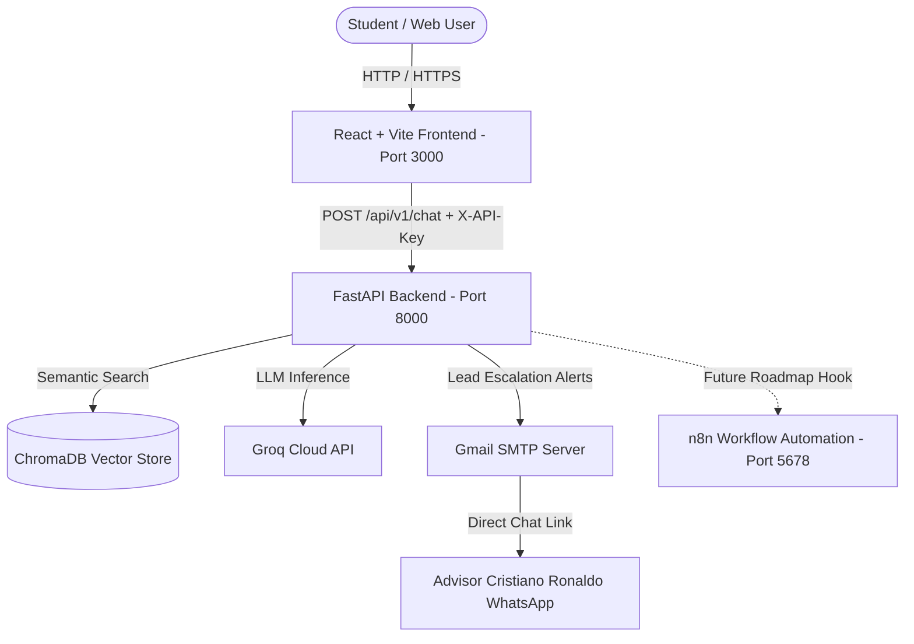

# Academia Lumina AI - Intelligent Customer Support System

[](https://www.docker.com/)
[](https://www.python.org/)
[](https://fastapi.tiangolo.com/)
[](https://groq.com/)
[](https://www.trychroma.com/)
[](https://reactjs.org/)
[](https://vitejs.dev/)

An enterprise-grade, full-stack AI Customer Support System built for **Academia Lumina** (a premier language academy in Colombia). Powered by **Retrieval-Augmented Generation (RAG)** over official academic documents, **Groq ultra-fast LLM inference**, **4 Cybersecurity defense layers**, **Dynamic Multilingual (EN/ES) support**, and **Interactive Lead Capture with WhatsApp redirection**.

---

## 🌟 Key Features

- **🧠 RAG Knowledge Engine**: Semantic search using ChromaDB embeddings and Groq LLM (`openai/gpt-oss-120b` / Llama 3.3 70B) with memory TTL caching.
- **🛡️ 4 Cybersecurity Layers**:
  1. *Real Client IP Rate Limiting* behind reverse proxies (SlowAPI).
  2. *API Key Authentication* via `X-API-Key` headers.
  3. *Anti-Prompt Injection Guardrails* with NFKD Unicode normalization.
  4. *PII Redaction & HTML XSS Sanitization* in emails and responses.
- **🌐 Real-Time Multilingual (i18n)**: Instant English/Spanish UI toggle and strict language-matching LLM responses.
- **🌙 Dark / Light Accessible Theme**: Egyptian Sand & Gold (Light) and Deep Obsidian Gold (Dark) palettes with smooth transitions.
- **📱 Mobile-First Responsive Design**: Fullscreen native sheet chat on mobile devices (`<600px`), interactive CEFR A1→C1 progression flowchart, and expandable course cards.
- **📥 Lead Capture & Automated Dispatch**: In-chat contact form for unlisted queries, SMTP notification emails to administrators, and direct pre-filled WhatsApp conversation links for advisor **Cristiano Ronaldo**.
- **🔮 Future Roadmap / Optional Extension (n8n Integration)**: An included `n8n` service blueprint for future multi-channel automation (Meta WhatsApp Cloud API, Telegram, CRMs like HubSpot/Salesforce).

---

## 🏗️ System Architecture



> **📌 Note on n8n:** The web application and backend operate **100% autonomously**. The included `n8n` container and `workflow.json` serve as an optional, decoupled future expansion milestone to connect external messaging channels (WhatsApp Cloud API, Telegram) without touching Python backend code.

---

## 🔑 Environment Configuration

Create a `.env` file in the `backend/` directory based on `.env.example`:

```bash
cd backend
cp .env.example .env
```

### Backend `.env` Variables:

```env
# Groq API Key for LLM Inference (Obtain free at console.groq.com/keys)
GROQ_API_KEY=gsk_your_actual_groq_key_here

# Secret API Key for authenticating Frontend & external requests
BACKEND_API_KEY=lumina_secret_key_2026

# Execution Environment (development / production)
ENVIRONMENT=development

# Storage directory for ChromaDB vector embeddings
CHROMA_DB_DIR=./chroma_data

# Rate Limiting per Client IP (Cybersecurity)
RATE_LIMIT_PER_MINUTE=10/minute

# Server Port
PORT=8000

# Target email for escalated student leads
ESCALATION_EMAIL=breynermanga07@gmail.com

# SMTP Credentials for Email Dispatch
SMTP_HOST=smtp.gmail.com
SMTP_PORT=587
SMTP_USER=breynermanga07@gmail.com
SMTP_PASSWORD=your_16_character_app_password
SMTP_USE_TLS=true
SMTP_SENDER_EMAIL=breynermanga07@gmail.com

# Allowed CORS Origins (Comma-separated)
ALLOWED_ORIGINS=http://localhost:3000,http://localhost:8000,http://127.0.0.1:3000
```

---

## 🚀 Quick Start with Docker (Recommended)

Run the entire containerized ecosystem with a single command:

```bash
docker compose up -d --build
```

### Service Endpoints:
- 🌐 **Web Frontend**: [http://localhost:3000](http://localhost:3000)
- ⚡ **Backend API & Swagger Docs**: [http://localhost:8000/docs](http://localhost:8000/docs)
- 🩺 **Health Check**: [http://localhost:8000/api/v1/health](http://localhost:8000/api/v1/health)
- 📊 **Metrics**: [http://localhost:8000/api/v1/metrics](http://localhost:8000/api/v1/metrics)
- 🔮 **n8n Automation Console (Optional Future Extension)**: [http://localhost:5678](http://localhost:5678)

---

## 🧪 Automated Testing

Execute the comprehensive Pytest suite inside the backend container:

```bash
docker exec lumina_backend pytest -v
```

### Test Suite Coverage:
- `test_security.py`: API key authorization, prompt injection defenses, and invalid key rejections.
- `test_rag_service.py`: Semantic retrieval, multilingual prompt handling, TTL caching, and escalation triggers.
- `test_email_service.py`: HTML template generation, PII sanitization, and asynchronous SMTP delivery.
- `test_health.py` & `test_extras.py`: Operational health checks and lifecycle validation.

---

## 📂 Project Structure

```text
.
├── backend/
│   ├── app/
│   │   ├── api/v1/endpoints/  # Chat, Lead, Health & Metrics endpoints
│   │   ├── core/              # Security, Guardrails & Pydantic Config
│   │   ├── data/              # Markdown Knowledge Base documents
│   │   ├── db/                # ChromaDB VectorStore & TTL Cache
│   │   ├── schemas/           # Pydantic Request/Response models
│   │   ├── services/          # RAG, Ingestion, Email & Metrics services
│   │   └── main.py            # FastAPI Application Entrypoint
│   ├── tests/                 # 16 automated Pytest test suites
│   ├── Dockerfile
│   └── requirements.txt
├── frontend/
│   ├── src/
│   │   ├── components/        # Navbar, Hero, Programs, Flowchart, Chat, etc.
│   │   ├── context/           # LanguageContext (i18n) & ThemeContext (Dark Mode)
│   │   ├── services/          # API client helper
│   │   ├── App.jsx            # SPA Application Root
│   │   └── App.css            # Responsive Design System
│   ├── Dockerfile
│   └── package.json
├── n8n/
│   └── workflow.json          # Blueprint for future omnichannel expansion
├── docker-compose.yml
├── DOCUMENTATION.md           # Comprehensive Technical Documentation
└── README.md
```

---

## 📄 License
Developed for Academia Lumina. All rights reserved © 2026.
