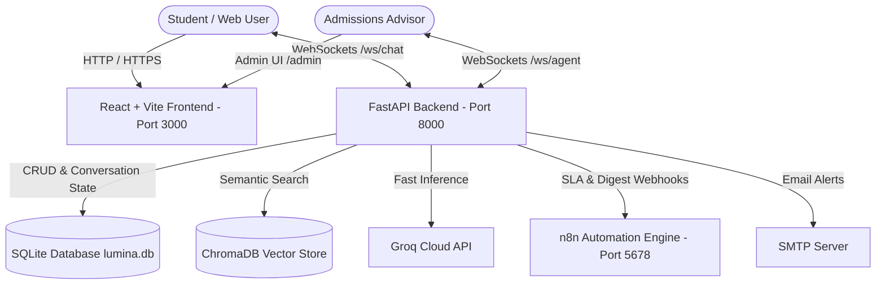

# Academia Lumina AI - Intelligent Multilingual Customer Support & Live Handoff System

[](https://www.docker.com/)
[](https://www.python.org/)
[](https://fastapi.tiangolo.com/)
[](https://groq.com/)
[](https://www.trychroma.com/)
[](https://reactjs.org/)
[](https://vitejs.dev/)
[](https://www.sqlite.org/)
[](https://fastapi.tiangolo.com/advanced/websockets/)

An enterprise-grade, full-stack AI Customer Support System built for **Academia Lumina** (a language academy in Colombia). Powered by **Retrieval-Augmented Generation (RAG)** over official academic documents, **Groq ultra-fast LLM inference**, **4 Cybersecurity defense layers**, **Dynamic Multilingual (EN/ES) support**, **Real-Time WebSockets for Live Human Advisor Handoff**, and an **Admin Portal with Document Upload & SLA Monitoring**.

---

## 🌟 Key Features

- **🧠 RAG Knowledge Engine**: Semantic search using persistent ChromaDB embeddings and Groq LLM inference (`openai/gpt-oss-120b` / `openai/gpt-oss-20b` fallback) with memory TTL caching and exact token tracking.
- **💬 Real-Time Live Chat Handoff (WebSockets)**: Bi-directional WebSocket channels (`/ws/chat/{session_id}` for students and `/ws/agent` for admissions staff). Seamlessly transitions from AI bot to a real human advisor with presence badges and instant messaging.
- **🗄️ Full State Persistence (SQLite & SQLAlchemy 2.0)**: Tracks complete chat lifecycle (`bot` ➔ `pendiente` ➔ `en_atencion` ➔ `resuelto`), message logs, timestamps, and advisor assignments.
- **🔐 Secure Admin Portal (`/admin`)**: Protected by JWT authentication (bcrypt hashing), featuring:
  - **Live Agent Inbox**: Claim, respond in real-time, and resolve escalated tickets.
  - **Document Uploader**: Drag & drop `.md` files with automatic text chunking and immediate ChromaDB vector re-indexing.
  - **Live Metrics Dashboard**: Real-time token counts, estimated costs ($ USD), cache hit rate, and latency.
- **🛡️ 4 Cybersecurity Layers**:
  1. *Real Client IP Rate Limiting* with proxy sanitization (SlowAPI).
  2. *Dual Authentication* (Admin JWT Bearer tokens + `X-API-Key` headers for automated microservices).
  3. *Anti-Prompt Injection Guardrails* with NFKD Unicode normalization and leetspeak neutralization.
  4. *PII Redaction & HTML XSS Sanitization* across all communications.
- **🌐 Multilingual Support (i18n)**: English/Spanish UI toggle and strict language-matching LLM responses.
- **🌙 Accessible Design System**: Egyptian Sand & Gold (Light) and Obsidian Gold (Dark) palettes with 60fps transitions.
- **⚙️ Complete n8n Automation Workflows**:
  - `workflow.json`: RAG Router & webhook gateway.
  - `workflow_sla.json`: Scheduled cron monitoring unassigned pending leads (>10 min) with supervisor alerts.
  - `workflow_reportes.json`: Daily 8:00 AM executive performance and metrics digest.

---

## 🏗️ System Architecture



---

## 🔑 Environment Configuration

### 1. Backend Configuration (`backend/.env`)

Copy the example file and configure your environment variables:

```bash
cd backend
cp .env.example .env
```

| Variable | Description | Default / Example |
|---|---|---|
| `GROQ_API_KEY` | Groq API Key for LLM Inference ([Get key](https://console.groq.com/keys)) | `gsk_your_groq_key_here` |
| `GEMINI_API_KEY` | Google Gemini API Key for Vector Embeddings | `AIzaSy_your_gemini_key_here` |
| `BACKEND_API_KEY` | Secret API Key for authenticating microservices / n8n | `lumina_secret_key_2026` |
| `JWT_SECRET_KEY` | Secret key for signing Admin JWT tokens | `lumina_jwt_super_secret_key_2026` |
| `ADMIN_USERNAME` | Initial administrator username for panel login | `admin` |
| `ADMIN_PASSWORD` | Initial administrator password for panel login | `admin123` |
| `ALLOWED_ORIGINS` | Comma-separated allowed CORS origins | `http://localhost:3000,http://127.0.0.1:3000` |
| `RATE_LIMIT_PER_MINUTE`| Maximum allowed requests per minute per IP | `10/minute` |
| `ADVISOR_NAME` | Name of the admissions advisor | `Asesor de Admisiones` |
| `WHATSAPP_NUMBER` | Official WhatsApp contact phone number | `+57 324 783 6387` |
| `WHATSAPP_URL` | Direct WhatsApp URL endpoint | `https://wa.me/573247836387` |
| `ESCALATION_EMAIL` | Destination email for supervisor alerts and digests | `admissions@academialumina.edu.co` |
| `SMTP_HOST` / `PORT` | SMTP Server configuration | `smtp.gmail.com` / `587` |
| `SMTP_USER` / `PASSWORD`| SMTP authentication credentials | `your_email@gmail.com` / `app_password` |

### 2. Frontend Configuration (`frontend/.env`)

```bash
cd frontend
cp .env.example .env
```

| Variable | Description | Default |
|---|---|---|
| `VITE_BACKEND_URL` | Base URL of the FastAPI Backend | `http://localhost:8000` |
| `VITE_BACKEND_API_KEY` | Secret API Key (must match `BACKEND_API_KEY`) | `lumina_secret_key_2026` |

---

## 🚀 Quick Start with Docker (Recommended)

Start the entire application stack:

```bash
docker compose up -d --build
```

### Service URLs:
- 🌐 **Web Landing Page & Student Chat**: [http://localhost:3000](http://localhost:3000)
- 🔒 **Admin Portal & Live Inbox**: [http://localhost:3000/admin/login](http://localhost:3000/admin/login) *(User: `admin` / Password: `admin123`)*
- ⚡ **Backend API & Swagger Docs**: [http://localhost:8000/docs](http://localhost:8000/docs)
- 🩺 **Health Check**: [http://localhost:8000/api/v1/health](http://localhost:8000/api/v1/health)
- 📊 **Metrics Endpoint**: [http://localhost:8000/api/v1/metrics](http://localhost:8000/api/v1/metrics)
- ⚙️ **n8n Automation Console**: [http://localhost:5678](http://localhost:5678)

---

## 🧪 Automated Testing

Execute the complete 43-test suite inside the backend container:

```bash
docker exec lumina_backend pytest -v
```

---

## ☁️ Deployment Notes & Free-Tier Ephemeral Disk Limitation

> [!WARNING]
> **Render Free-Tier Ephemeral Disk Storage Notice:**
> Free-tier instances on cloud platforms such as Render, Railway, or Fly.io use an **ephemeral filesystem**. This means that any files written during runtime (such as the local SQLite database file `lumina.db`, vector store chunks in `./chroma_data`, or newly uploaded Markdown documents in `app/data/`) will be reset whenever the service restarts, spins down due to inactivity, or redeploys.
>
> **Production Recommendation:**
> For persistent cloud deployments:
> 1. Attach a persistent volume (e.g. Render Persistent Disk) mounted to `/app/lumina.db` and `/app/chroma_data`.
> 2. Alternatively, configure PostgreSQL (`postgresql://...`) via SQLAlchemy for conversation history and a managed Chroma / Pinecone / pgvector instance for document embeddings.

---

## 📂 Project Structure

```text
.
├── backend/
│   ├── app/
│   │   ├── api/v1/endpoints/  # Chat, Lead, Admin, Health, Metrics & WebSockets
│   │   ├── core/              # Security, Auth (JWT/Bcrypt), Guardrails & Config
│   │   ├── data/              # Markdown Knowledge Base documents
│   │   ├── db/                # SQLite Models, Session, Repository & ChromaDB
│   │   ├── schemas/           # Pydantic v2 Models & Admin Schemas
│   │   ├── services/          # RAG, Ingestion, Email, Metrics & ConnectionManager
│   │   └── main.py            # FastAPI Entrypoint & Database Lifespan
│   ├── tests/                 # 43 Unit and Integration Test suites
│   ├── Dockerfile
│   └── requirements.txt
├── frontend/
│   ├── src/
│   │   ├── components/        # FloatingChat, AdminDashboard, AdminLogin, Hero, etc.
│   │   ├── context/           # LanguageContext (i18n) & ThemeContext
│   │   ├── services/          # API & WebSocket client helpers
│   │   ├── App.jsx            # Routing (/ & /admin)
│   │   └── App.css            # Unified Design System
│   ├── Dockerfile
│   └── package.json
├── n8n/
│   ├── workflow.json          # Core RAG Router & Escalation webhook
│   ├── workflow_sla.json      # 5-min Cron SLA breach monitor
│   ├── workflow_reportes.json # Daily 8:00 AM executive metrics digest
│   └── README_N8N.md          # n8n Setup & Import Guide
├── docker-compose.yml
├── docs.md                    # Comprehensive Technical Specification (Spanish)
└── README.md                  # Project Documentation
```

---

## 📄 License
Developed for Academia Lumina. All rights reserved © 2026.
