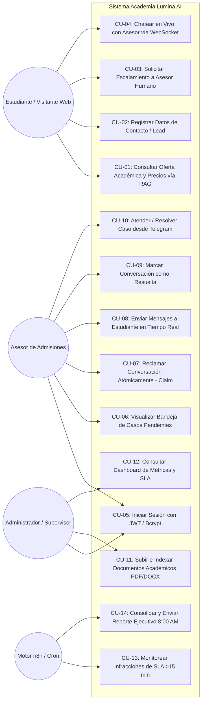
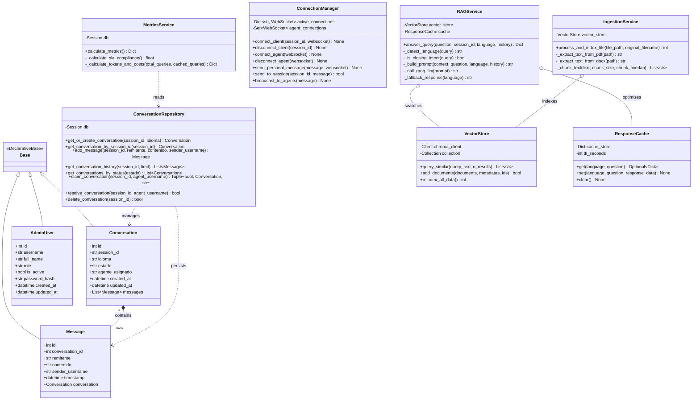
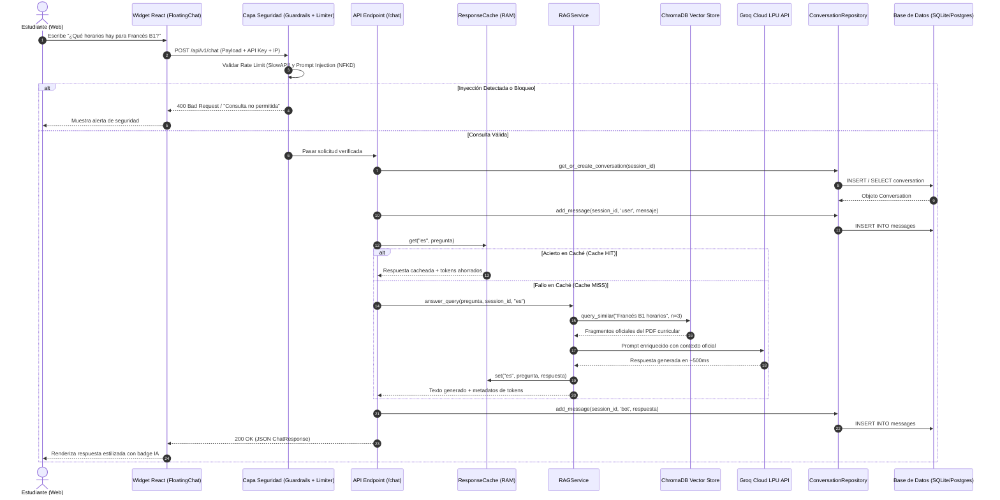
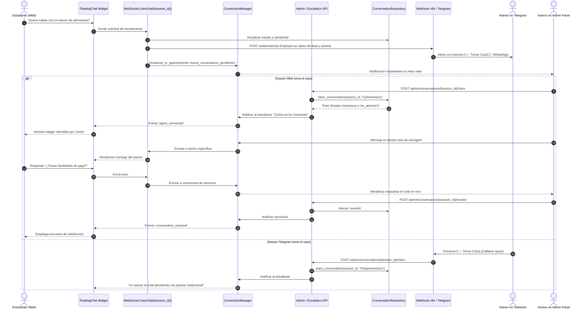

# 02. Especificación y Diagramas UML: Academia Lumina AI

Este documento contiene la descripción textual detallada y el modelado visual en sintaxis **Mermaid** de los casos de uso, estructura de clases y dinámicas de interacción del sistema.

---

## 1. Diagrama de Casos de Uso del Sistema

### 1.1 Actores del Sistema
1. **Estudiante / Prospecto (Web User)**: Actor primario externo que interactúa a través del widget de chat en la landing page para recibir orientación académica, consultar precios/horarios o pedir hablar con un humano.
2. **Asesor de Admisiones (Humano)**: Actor primario interno encargado de atender a los prospectos cuando se requiere atención personalizada, tanto desde la consola web (`/admin`) como desde Telegram móvil.
3. **Administrador del Sistema / Supervisor**: Actor secundario interno responsable de supervisar métricas de atención (SLA), cargar nueva documentación curricular y auditar el rendimiento del bot.
4. **Motor de Automatización (n8n Engine)**: Actor de sistema automatizado que ejecuta tareas cron periódicas (revisión de SLA, reporte matutino) y enruta webhooks hacia pasarelas de mensajería.

### 1.2 Diagrama Mermaid de Casos de Uso

---

## 2. Diagrama de Clases del Backend

El diagrama refleja la estructura de clases del backend en Python/FastAPI, organizadas por capas: Modelos ORM, Servicios de Negocio, Acceso a Datos y Controladores.

---

## 3. Diagramas de Secuencia

### 3.1 Diagrama de Secuencia 1: Consulta RAG del Usuario (Flujo Principal)
Representa el camino que sigue un mensaje del usuario desde el navegador web hasta la respuesta generada por Groq LPU con protección de ciberseguridad y caché.

---

### 3.2 Diagrama de Secuencia 2: Escalamiento y Chat en Vivo Bidireccional (WebSocket Handoff)
Representa la transición cuando el usuario pide un asesor, el sistema notifica por Telegram y WebSockets, un asesor toma el caso y se comunican en vivo.

