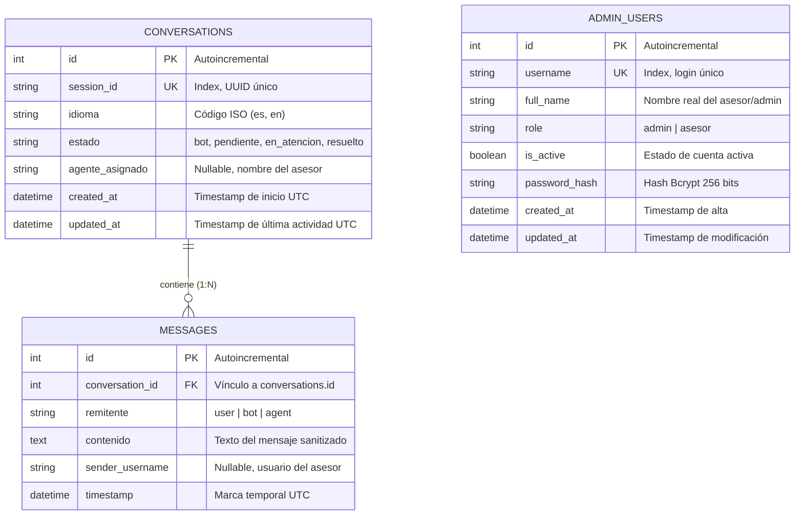
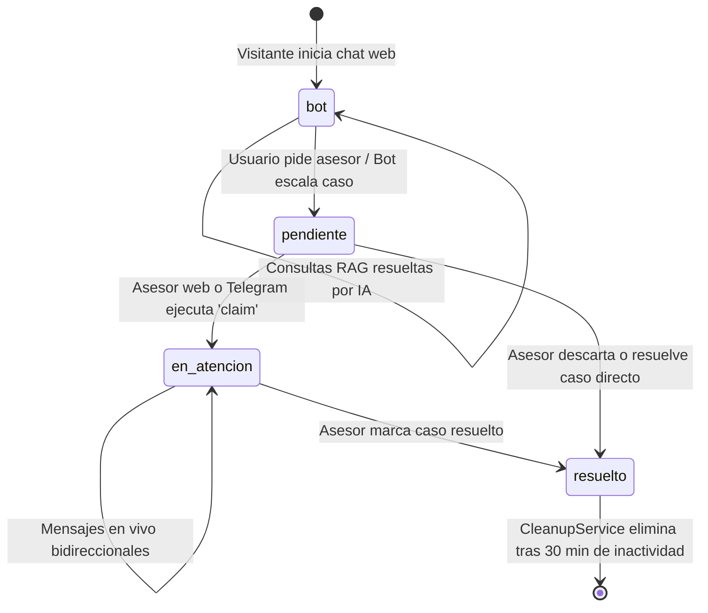

# 03. Modelo de Datos y Persistencia: Academia Lumina AI

Este documento detalla la estructura física y lógica del modelo de datos relacional implementado con **SQLAlchemy 2.0**, compatible con **SQLite** (entorno de desarrollo y pruebas) y **PostgreSQL** (entorno de producción en la nube / Render).

---

## 1. Diccionario de Datos y Tablas

### 1.1 Tabla: `conversations`
Almacena el estado, la trazabilidad del ciclo de vida y los metadatos de cada sesión de chat iniciada por un visitante o estudiante.

| Columna | Tipo de Dato | Nulo | Restricciones / Claves | Descripción |
| :--- | :--- | :--- | :--- | :--- |
| `id` | `INTEGER` | **NO** | `PRIMARY KEY AUTOINCREMENT` | Identificador único secuencial de la conversación. |
| `session_id` | `VARCHAR(100)` | **NO** | `UNIQUE, INDEX` | Identificador UUID generado por el cliente web para la sesión. |
| `idioma` | `VARCHAR(10)` | **NO** | `DEFAULT 'es'` | Idioma detectado de la interacción (`es` para español, `en` para inglés). |
| `estado` | `VARCHAR(30)` | **NO** | `DEFAULT 'bot', INDEX` | Estado actual del ciclo de vida (`bot`, `pendiente`, `en_atencion`, `resuelto`). |
| `agente_asignado` | `VARCHAR(100)`| SÍ | `NULLABLE` | Nombre de usuario del asesor humano que reclamó la conversación. |
| `created_at` | `DATETIME` | **NO** | `DEFAULT UTC_NOW` | Marca temporal exacta de creación de la sesión. |
| `updated_at` | `DATETIME` | **NO** | `DEFAULT UTC_NOW, ON UPDATE` | Marca temporal de la última interacción o transición de estado. |

### 1.2 Tabla: `messages`
Registra cada mensaje individual intercambiado dentro de una conversación, preservando la transcripción completa para auditoría y contexto del asesor.

| Columna | Tipo de Dato | Nulo | Restricciones / Claves | Descripción |
| :--- | :--- | :--- | :--- | :--- |
| `id` | `INTEGER` | **NO** | `PRIMARY KEY AUTOINCREMENT` | Identificador único del mensaje. |
| `conversation_id` | `INTEGER` | **NO** | `FOREIGN KEY (conversations.id) ON DELETE CASCADE, INDEX` | Vínculo relacional hacia la conversación padre. |
| `remitente` | `VARCHAR(20)` | **NO** | `CHECK (user, bot, agent)` | Origen del mensaje: `user` (estudiante), `bot` (IA Groq), `agent` (humano). |
| `contenido` | `TEXT` | **NO** | Ninguna | Contenido textual del mensaje (sanitizado contra XSS y validado). |
| `sender_username` | `VARCHAR(50)` | SÍ | `NULLABLE` | Nombre del asesor que escribió el mensaje (si remitente es `agent`). |
| `timestamp` | `DATETIME` | **NO** | `DEFAULT UTC_NOW` | Fecha y hora exacta de registro del mensaje. |

### 1.3 Tabla: `admin_users`
Gestiona las cuentas de acceso al panel administrativo y de supervisión, con control de roles y contraseñas hasheadas.

| Columna | Tipo de Dato | Nulo | Restricciones / Claves | Descripción |
| :--- | :--- | :--- | :--- | :--- |
| `id` | `INTEGER` | **NO** | `PRIMARY KEY AUTOINCREMENT` | Identificador único del usuario administrativo. |
| `username` | `VARCHAR(50)` | **NO** | `UNIQUE, INDEX` | Nombre de usuario para autenticación en `/admin/login`. |
| `full_name` | `VARCHAR(100)`| SÍ | `NULLABLE` | Nombre completo del funcionario o asesor. |
| `role` | `VARCHAR(20)` | **NO** | `DEFAULT 'asesor'` | Rol de acceso: `admin` (superadministrador) o `asesor` (operador). |
| `is_active` | `BOOLEAN` | **NO** | `DEFAULT TRUE` | Bandera de activación de la cuenta (permite revocar accesos). |
| `password_hash` | `VARCHAR(255)`| **NO** | Ninguna | Hash seguro de la contraseña generado con el algoritmo Bcrypt. |
| `created_at` | `DATETIME` | **NO** | `DEFAULT UTC_NOW` | Fecha de creación del usuario. |
| `updated_at` | `DATETIME` | **NO** | `DEFAULT UTC_NOW, ON UPDATE` | Fecha de última actualización del perfil. |

---

## 2. Diagrama Entidad-Relación (Mermaid ER)



---

## 3. Script DDL de Creación de Tablas (SQL Estándar)

Este script refleja con exactitud el esquema generado automáticamente por SQLAlchemy al inicializar el backend:

```sql
-- 1. Tabla de Conversaciones
CREATE TABLE IF NOT EXISTS conversations (
    id SERIAL PRIMARY KEY,
    session_id VARCHAR(100) NOT NULL UNIQUE,
    idioma VARCHAR(10) NOT NULL DEFAULT 'es',
    estado VARCHAR(30) NOT NULL DEFAULT 'bot',
    agente_asignado VARCHAR(100) NULL,
    created_at TIMESTAMP WITH TIME ZONE NOT NULL DEFAULT CURRENT_TIMESTAMP,
    updated_at TIMESTAMP WITH TIME ZONE NOT NULL DEFAULT CURRENT_TIMESTAMP
);

CREATE INDEX IF NOT EXISTS ix_conversations_session_id ON conversations (session_id);
CREATE INDEX IF NOT EXISTS ix_conversations_estado ON conversations (estado);

-- 2. Tabla de Mensajes
CREATE TABLE IF NOT EXISTS messages (
    id SERIAL PRIMARY KEY,
    conversation_id INTEGER NOT NULL,
    remitente VARCHAR(20) NOT NULL,
    contenido TEXT NOT NULL,
    sender_username VARCHAR(50) NULL,
    timestamp TIMESTAMP WITH TIME ZONE NOT NULL DEFAULT CURRENT_TIMESTAMP,
    CONSTRAINT fk_messages_conversation 
        FOREIGN KEY (conversation_id) 
        REFERENCES conversations (id) 
        ON DELETE CASCADE
);

CREATE INDEX IF NOT EXISTS ix_messages_conversation_id ON messages (conversation_id);

-- 3. Tabla de Usuarios Administrativos
CREATE TABLE IF NOT EXISTS admin_users (
    id SERIAL PRIMARY KEY,
    username VARCHAR(50) NOT NULL UNIQUE,
    full_name VARCHAR(100) NULL,
    role VARCHAR(20) NOT NULL DEFAULT 'asesor',
    is_active BOOLEAN NOT NULL DEFAULT TRUE,
    password_hash VARCHAR(255) NOT NULL,
    created_at TIMESTAMP WITH TIME ZONE NOT NULL DEFAULT CURRENT_TIMESTAMP,
    updated_at TIMESTAMP WITH TIME ZONE NOT NULL DEFAULT CURRENT_TIMESTAMP
);

CREATE INDEX IF NOT EXISTS ix_admin_users_username ON admin_users (username);
```

---

## 4. Máquina de Estados del Ciclo de Vida de una Conversación

Las conversaciones transicionan a través de 4 estados rigurosamente controlados:



### Reglas de Transición:
1. **`bot`**: Estado inicial por defecto. Las interacciones son manejadas 100% por Groq LLM + RAG.
2. **`pendiente`**: Se activa si el usuario escribe frases de escalamiento ("quiero un asesor", "hablar con humano") o si el clasificador de intención detecta necesidad humana. En este estado se dispara el webhook a n8n/Telegram y la alerta WebSocket a todos los asesores conectados.
3. **`en_atencion`**: Se activa mediante la operación atómica `claim_conversation()`. Bloquea la conversación para que ningún otro asesor interfiera. La interfaz de chat web se conecta al canal del asesor asignado.
4. **`resuelto`**: El asesor finaliza la atención (`resolve_conversation()`). Se envía mensaje de despedida y se habilita el widget para una nueva consulta.
5. **Purga Automática**: El hilo en segundo plano `CleanupService` ejecuta periódicamente:
   ```python
   # Elimina conversaciones resueltas con más de 30 minutos de antigüedad
   threshold = datetime.now(timezone.utc) - timedelta(minutes=30)
   db.query(Conversation).filter(
       Conversation.estado == "resuelto",
       Conversation.updated_at < threshold
   ).delete()
   ```
